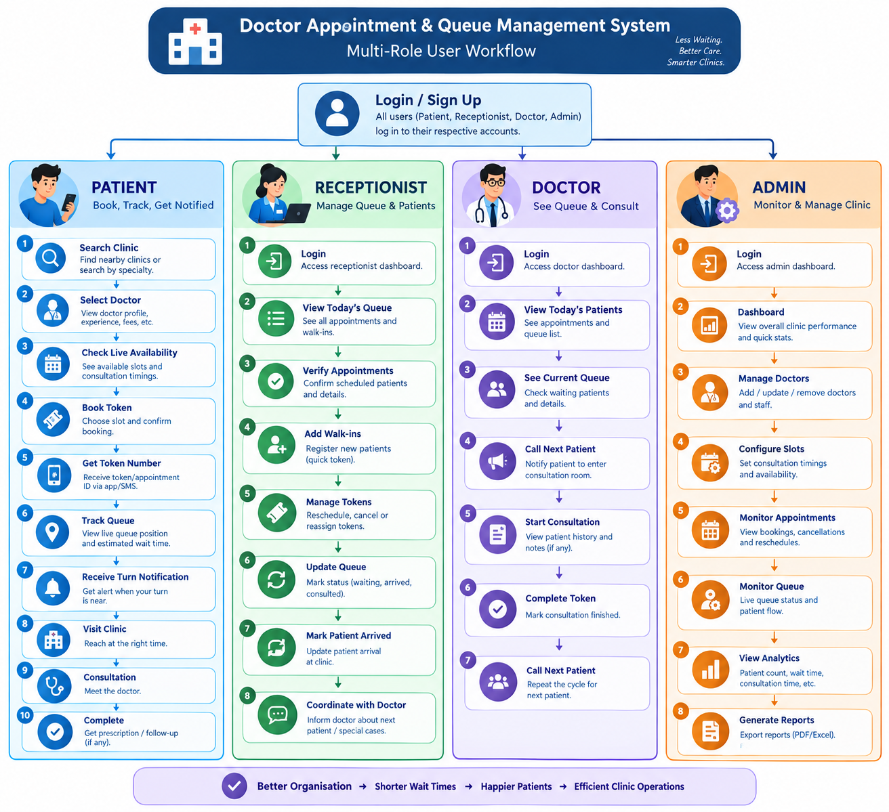
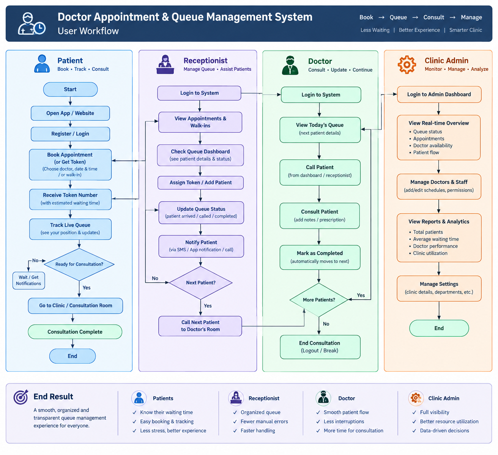
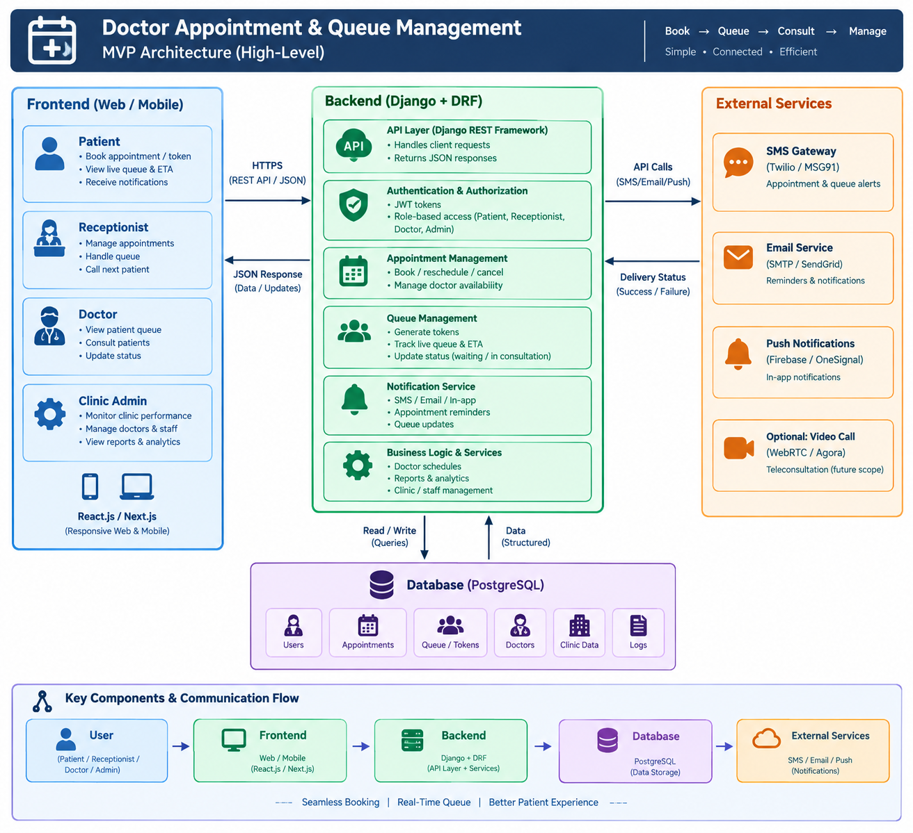
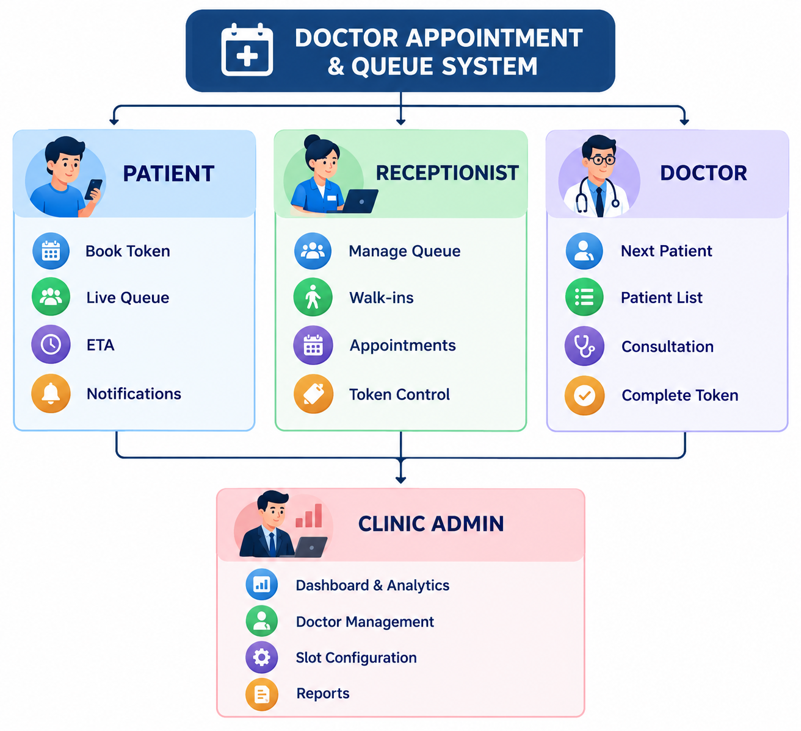

# MAREEZ-AND-DOCTOR

# 🏥 Doctor Appointment & Queue Management System

## Problem Statement

Small clinics face long waiting times, overcrowding, manual token management, and poor queue visibility. Patients often don't know when their turn will come.

 Solution:

A multi-role system where patients can book tokens, view live queue status, and track their turn, while clinic staff can efficiently manage appointments and queues.

 Roles:

* Patient — Book, track queue & get notifications
* Receptionist — Manage appointments, walk-ins & tokens
* Doctor — Manage patient queue & consultations
* Admin — Manage clinic, doctors & analytics

 Research:

* Top 5 Real-World Pain Points
* User Flow
* Feature Mapping
* Persona Matrix

 Documents:

* [features.md](features.md) — MVP scope, modules, technical rules and database tables
* [Research (.docx)](DOCTOR%20APPOINTMENT%20AND%20QUEUE%20MANAGEMENT.docx) — pain points, persona matrix, gap analysis
* **Functions.png**
   -  Core system functions including appointment booking, token generation, live queue tracking, ETA updates, notifications, consultation management, and clinic administration.
* **User Flow,png**
    - End-to-end user workflow showing how patients book appointments, track their live queue, receive notifications, and complete consultation, along with receptionist, doctor, and clinic admin interactions.

* **MVP Architecture.png**
    - High-level MVP architecture showing the frontend, backend, database, authentication, queue management, notifications, and communication between system components.

* **Feature Mapping.png**
   -  Feature mapping connecting the identified pain points and user personas with the corresponding MVP features and system solutions.
