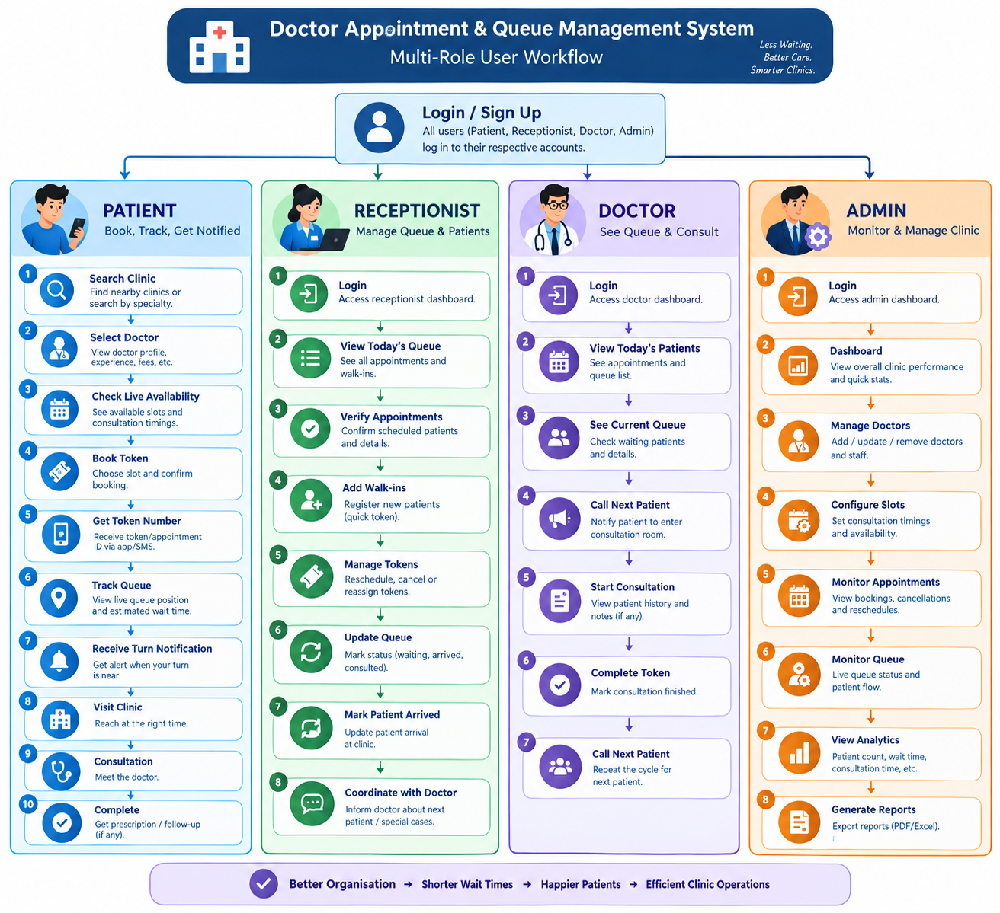
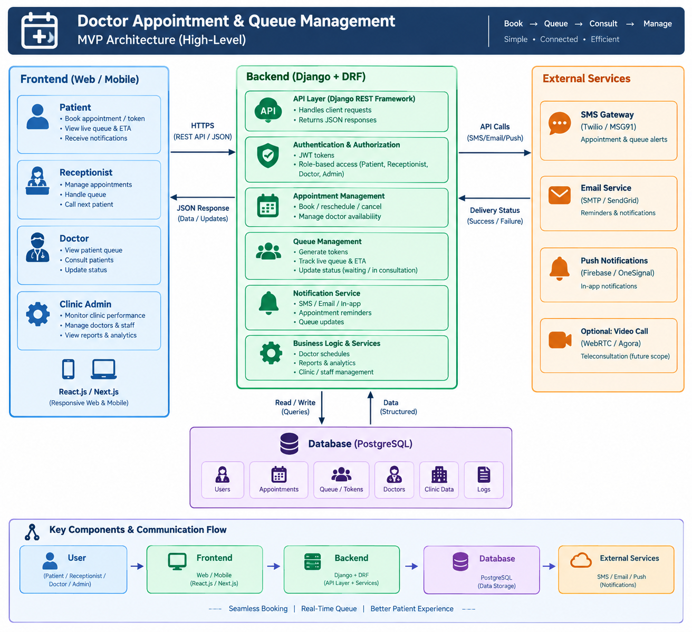
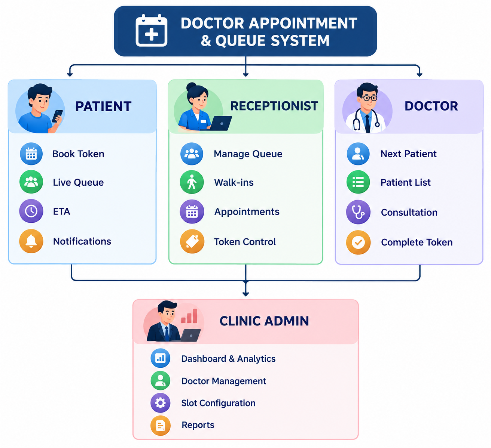

<<<<<<< HEAD
# Doctor Appointment & Queue Management System (DoctorQueue)
### Production-Ready Django + DRF + PostgreSQL + Django Templates + Tailwind CSS + Vanilla JS

DoctorQueue is a modern, responsive web application engineered for clinics to eliminate waiting time uncertainty through live queue tracking, atomic token generation, dynamic wait-time calculation, and seamless coordination between patients, receptionists, doctors, and clinic administrators.

---

## Key Features

1. **Patient Portal**:
   - Specialty & doctor discovery with real-time fee and schedule details.
   - Interactive date and slot picker with double-booking prevention.
   - Live queue tracking with 5-second polling, dynamic ETA calculation, and visual progress stages.
   - Instant call-to-room alerts with audible and visual indicators.

2. **Receptionist Queue Control**:
   - Unified real-time queue table supporting online appointments and walk-in patients.
   - 1-click walk-in registration with atomic sequential token generation.
   - Patient check-in (mark arrived) and status coordination.

3. **Doctor Consultation Desk**:
   - Real-time waiting queue sidebar.
   - 1-click **Call Next Patient** action.
   - Clinical observation notes and prescription record management.
   - Atomic state transitions (`CALLED` $\rightarrow$ `CONSULTING` $\rightarrow$ `COMPLETED`).

4. **Clinic Admin Command Center**:
   - Real-time operational KPI metrics (Total Tokens, In Queue, Average Wait Time, Active Doctors).
   - Real-time queue load distribution gauge.
   - Audit trail and live activity logs stream.

5. **Authoritative Backend State**:
   - Single source of truth in PostgreSQL.
   - Robust `QueueService` with concurrency locks (`select_for_update`) to prevent race conditions.
   - JWT authentication (SimpleJWT) with role-based access control.

---

## Tech Stack

- **Backend**: Python 3.12+, Django 5.1+, Django REST Framework (DRF), SimpleJWT, PostgreSQL (`psycopg 3.2+`)
- **Frontend**: Django Templates, HTML5, Tailwind CSS, Vanilla JavaScript (Centralized `api.js` + Fetch API)
- **Architecture**: Service Layer (`AppointmentService`, `QueueService`, `ConsultationService`, `DashboardService`, `NotificationService`)

---

## Quick Start

### 1. Install Dependencies
```bash
pip install -r requirements.txt
```

### 2. Configure Environment (`.env`)
```ini
DEBUG=True
SECRET_KEY=django-insecure-smartcare-doctorqueue-system-key-2026-prod-ready
ALLOWED_HOSTS=*
DB_NAME=doctor_queue
DB_USER=postgres
DB_PASSWORD=1234
DB_HOST=localhost
DB_PORT=5432
TIME_ZONE=Asia/Kolkata
```

### 3. Apply Migrations & Seed Demo State
```bash
python manage.py migrate
python manage.py seed_demo --reset
```

### 4. Run Development Server
```bash
python manage.py runserver
```

Open `http://127.0.0.1:8000/` in your browser.

---

## Demo Accounts (Password: `Demo@123`)

| Role | Identifier (Phone/Email) | Description |
| :--- | :--- | :--- |
| **Patient** | `9000000001` / `aarav.patient@example.com` | Primary Patient (Token `A-27`, Position 4, 3 ahead, ETA 30m) |
| **Receptionist** | `9000000002` / `reception@smartcare.example.com` | Unified queue desk, walk-ins |
| **Doctor** | `9000000003` / `rajesh.doctor@example.com` | Dr. Rajesh Kumar (General Physician) |
| **Doctor** | `9000000004` / `neha.doctor@example.com` | Dr. Neha Verma (Cardiologist) |
| **Admin** | `9000000005` / `admin@smartcare.example.com` | Clinic Operations & Metrics |

---

## Running Automated Tests
```bash
python manage.py test
```
=======
# MAREEZ-AND-DOCTOR

# 🏥 Doctor Appointment & Queue Management System

## Problem Statement

Small clinics face long waiting times, overcrowding, manual token management, and poor queue visibility. Patients often don't know when their turn will come.

 Solution:

A multi-role system where patients can book tokens, view live queue status, and track their turn, while clinic staff can efficiently manage appointments and queues.

 Roles:

* Patient — Book, track queue & get notifications
* Receptionist — Manage appointments, walk-ins & tokens
* Doctor — Manage patient queue & consultations
* Admin — Manage clinic, doctors & analytics

 Research:

* Top 5 Real-World Pain Points
* User Flow
* Feature Mapping
* Persona Matrix


 Documents:

* [features.md](features.md) — MVP scope, modules, technical rules and database tables
* [Research (.docx)](DOCTOR%20APPOINTMENT%20AND%20QUEUE%20MANAGEMENT.docx) — pain points, persona matrix, gap analysis
* **Functions.png**
   -  Core system functions including appointment booking, token generation, live queue tracking, ETA updates, notifications, consultation management, and clinic administration.
* **User Flow,png**
    - End-to-end user workflow showing how patients book appointments, track their live queue, receive notifications, and complete consultation, along with receptionist, doctor, and clinic admin interactions.

* **MVP Architecture.png**
    - High-level MVP architecture showing the frontend, backend, database, authentication, queue management, notifications, and communication between system components.

* **Feature Mapping.png**
   -  Feature mapping connecting the identified pain points and user personas with the corresponding MVP features and system solutions.
>>>>>>> 2a5446983469291b1edfc956143abbd9c7e193fd
