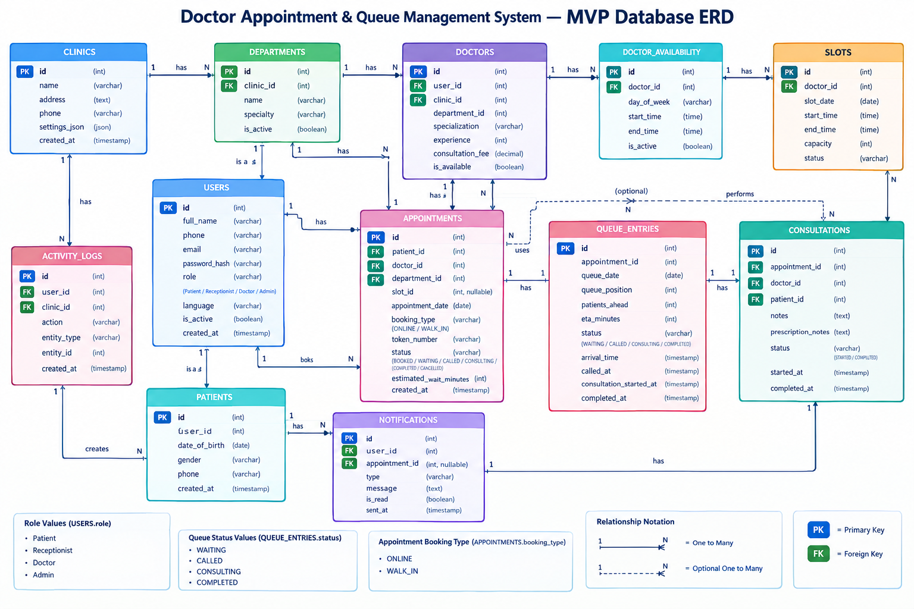

# Database

## 1. Database Summary

The system uses **PostgreSQL** as its relational database for storing and managing application data.

It stores:

* User and authentication data
* Doctor information
* Doctor availability
* Appointment slots
* Patient appointments
* Related application records

---

## 2. Database Tech Stack

| Technology | Purpose                      |
| ---------- | ---------------------------- |
| PostgreSQL | Relational database          |
| Django ORM | Database interaction         |
| SQL        | Data querying and management |

---

## 3. Database Flow

```text
Frontend
   ↓
Django REST API
   ↓
Django ORM
   ↓
PostgreSQL
   ↓
Database Response
   ↓
Django API
   ↓
Frontend
```

---

## 4. Main Data Flow

```text
User
 ↓
Doctor Selection
 ↓
Availability
 ↓
Time Slot
 ↓
Appointment
 ↓
PostgreSQL
```

---

## 5. Core Database Entities

| Entity              | Purpose                         |
| ------------------- | ------------------------------- |
| User                | Authentication and user details |
| Doctor              | Doctor information              |
| Doctor Availability | Doctor working schedule         |
| Slot                | Available appointment time      |
| Appointment         | Patient appointment records     |

### Basic Relationship

```text
User
 │
 └── Appointment
        │
        ├── Doctor
        │     └── Availability
        │
        └── Slot
```

---

## 6. Database Rules

* PostgreSQL is the primary database.
* Use Django ORM for database operations.
* Preserve existing data during updates.
* Use migrations for schema changes.
* Avoid duplicate records.
* Do not store plain-text passwords.
* Use proper foreign-key relationships.
* Do not reset or delete the database during normal development.

**Principle:** Maintain consistent, secure and reliable PostgreSQL data without breaking existing application relationships.


## 7. Database Diagram


