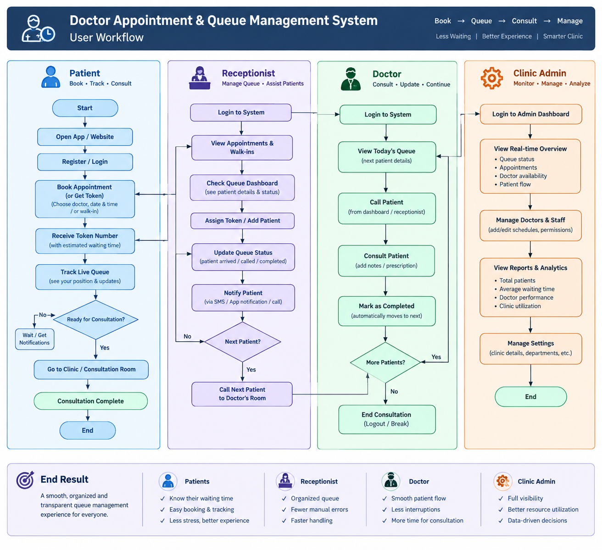

# 👥 User Flow

## Doctor Appointment & Queue Management System

The Doctor Appointment & Queue Management System provides a structured workflow for **Patients, Receptionists, Doctors, and Clinic Admins**. Each role has a dedicated workflow while all activities are connected through a unified appointment and queue management system.

---

## 🔐 Common Entry Flow

```text
Start
  ↓
Open Application / Website
  ↓
Login / Sign Up
  ↓
Role-Based Access
  ├── Patient
  ├── Receptionist
  ├── Doctor
  └── Clinic Admin
```

---

# 👤 1. Patient Workflow

### Goal

Allow patients to find a doctor, book an appointment/token, track their live queue position, receive notifications, and complete their consultation.

```text
Start
  ↓
Open App / Website
  ↓
Register / Login
  ↓
Search Clinic
  ↓
Select Doctor
  ↓
Check Live Availability
  ↓
Book Appointment / Get Token
  ↓
Receive Token Number
  ↓
Track Live Queue
  ↓
Receive Turn Notification
  ↓
Ready for Consultation?
  ├── No → Wait / Get Notifications → Track Queue
  └── Yes
        ↓
Go to Clinic / Consultation Room
        ↓
Consultation
        ↓
Receive Prescription / Follow-up
        ↓
Complete
        ↓
End
```

### Patient Functions

- Search nearby clinics or doctors
- Search by medical specialty
- View doctor profile and availability
- Check available appointment slots
- Book appointment
- Generate queue token
- Receive estimated waiting time
- Track live queue position
- Receive turn notifications
- Visit clinic at the appropriate time
- Complete consultation
- Receive prescription or follow-up information

---

# 🧑‍💼 2. Receptionist Workflow

### Goal

Help clinic staff manage appointments, walk-ins, tokens, patient arrivals, and queue coordination.

```text
Login
  ↓
View Today's Appointments & Walk-ins
  ↓
Check Queue Dashboard
  ↓
Verify Appointments
  ↓
Add Walk-in Patient / Assign Token
  ↓
Manage Tokens
  ↓
Update Queue Status
  ↓
Mark Patient as Arrived
  ↓
Notify Patient
  ↓
Coordinate with Doctor
  ↓
Call Next Patient
  ↓
Next Patient?
  ├── Yes → Continue Queue
  └── No → End / Wait
```

### Receptionist Functions

- Login to receptionist dashboard
- View today's appointments
- View walk-in patients
- Verify scheduled appointments
- Register new walk-in patients
- Assign or generate tokens
- Reschedule appointments
- Cancel or reassign tokens
- Update patient queue status
- Mark patients as arrived
- Notify patients about their turn
- Coordinate with doctors
- Call the next patient

---

# 👨‍⚕️ 3. Doctor Workflow

### Goal

Allow doctors to manage the current queue, call patients, conduct consultations, and complete tokens.

```text
Login
  ↓
View Today's Queue
  ↓
View Current Patients
  ↓
Check Queue Details
  ↓
Call Next Patient
  ↓
Start Consultation
  ↓
View Patient History
  ↓
Add Notes / Prescription
  ↓
Complete Token
  ↓
More Patients?
  ├── Yes → Call Next Patient
  └── No → End Consultation / Break
```

### Doctor Functions

- Login to doctor dashboard
- View today's appointments
- View current queue
- Check waiting patients
- View patient details
- Call next patient
- Start consultation
- View relevant patient history
- Add consultation notes
- Add prescription/follow-up
- Mark token as completed
- Automatically continue with the next patient

---

# 🏥 4. Clinic Admin Workflow

### Goal

Provide complete visibility and management of clinic operations, doctors, appointments, queue performance, and reports.

```text
Login
  ↓
Admin Dashboard
  ↓
View Real-Time Overview
  ↓
Manage Doctors & Staff
  ↓
Configure Slots & Availability
  ↓
Monitor Appointments
  ↓
Monitor Live Queue
  ↓
View Analytics
  ↓
Generate Reports
  ↓
Manage Clinic Settings
  ↓
End
```

### Clinic Admin Functions

- Login to admin dashboard
- View real-time clinic overview
- Monitor queue status
- Monitor appointments
- Monitor doctor availability
- Manage doctors and staff
- Add, update, or remove doctors
- Configure consultation slots
- Configure doctor availability
- Monitor cancellations and reschedules
- Monitor live patient flow
- View patient and queue analytics
- Analyze waiting time
- Monitor clinic utilization
- Generate reports
- Export reports in PDF/Excel
- Manage clinic details and settings

---

# 🔄 Unified Queue Flow

The system connects all four roles through a centralized queue.

```text
Patient
   ↓
Appointment / Walk-in
   ↓
Token Generation
   ↓
Receptionist
   ↓
Queue Management
   ↓
Patient Arrival
   ↓
Doctor Queue
   ↓
Call Next Patient
   ↓
Consultation
   ↓
Complete Token
   ↓
Next Patient
```

---

# 🔔 Queue Status Flow

```text
Booked
  ↓
Token Generated
  ↓
Waiting
  ↓
Patient Arrived
  ↓
Called
  ↓
In Consultation
  ↓
Completed
```

### Additional Queue States

```text
Waiting → Cancelled
Waiting → Rescheduled
Waiting → No-show
```

---

# 📱 Role-Based System Flow

| Role | Main Responsibility | Key Actions |
|------|---------------------|-------------|
| 👤 Patient | Book & Track | Search doctor, book token, track queue, receive notifications |
| 🧑‍💼 Receptionist | Manage Queue | Verify appointments, add walk-ins, assign tokens, update queue |
| 👨‍⚕️ Doctor | Consultation | View queue, call patient, consult, complete token |
| 🏥 Clinic Admin | Manage & Analyze | Manage doctors, configure slots, monitor queue, analytics, reports |

---

# ⚙️ Role-Based Module Flow

```text
                    ┌─────────────────────┐
                    │   Login / Sign Up   │
                    └──────────┬──────────┘
                               ↓
                       Role-Based Access
                               │
          ┌────────────────────┼────────────────────┐
          ↓                    ↓                    ↓
      Patient             Receptionist           Doctor
          │                    │                    │
          ↓                    ↓                    ↓
   Book Appointment      Manage Queue       View Queue
          │                    │                    │
          ↓                    ↓                    ↓
    Get Token            Verify Patient       Call Patient
          │                    │                    │
          ↓                    ↓                    ↓
    Track Queue          Update Status        Consultation
          │                    │                    │
          ↓                    ↓                    ↓
  Get Notification       Notify Patient       Complete Token
          │                    │                    │
          └────────────────────┼────────────────────┘
                               ↓
                        Unified Queue
                               ↓
                     Clinic Admin Dashboard
                               ↓
                  Analytics / Reports / Settings
```

---

# 🎯 End Result

The complete workflow is designed to provide:

- **Less Waiting** for patients
- **Better Queue Organization** for receptionists
- **Smoother Patient Flow** for doctors
- **Real-Time Visibility** for clinic administrators
- **Better Resource Utilization**
- **Data-Driven Clinic Management**
- **Improved Patient Experience**

### Overall Flow

```text
Better Organisation
        ↓
Shorter Wait Times
        ↓
Happier Patients
        ↓
Efficient Clinic Operations
```

---

# 📊 User Workflow Diagram



---

# 🏁 Complete System Flow

```text
                    DOCTOR APPOINTMENT &
                  QUEUE MANAGEMENT SYSTEM
                              │
                              ↓
                       Login / Sign Up
                              │
                              ↓
                       Role-Based Access
                              │
        ┌─────────────────────┼─────────────────────┐
        ↓                     ↓                     ↓
     PATIENT             RECEPTIONIST            DOCTOR
        │                     │                     │
        ↓                     ↓                     ↓
 Search / Select        View Appointments      View Queue
     Doctor                   │                     │
        ↓                     ↓                     ↓
 Check Availability      Verify Appointment     Call Patient
        ↓                     │                     │
 Book Appointment        Add Walk-in             ↓
        ↓                     │               Consultation
 Generate Token              ↓                     │
        ↓                Assign Token              ↓
 Track Queue                 │               Complete Token
        ↓                     ↓                     │
 Notification           Update Queue               │
        │                     │                     │
        └─────────────────────┼─────────────────────┘
                              ↓
                       Unified Queue
                              ↓
                     Next Patient Cycle
                              │
                              ↓
                       CLINIC ADMIN
                              │
                ┌─────────────┼─────────────┐
                ↓             ↓             ↓
           Manage Staff   Monitor Queue   Analytics
                │             │             │
                └─────────────┼─────────────┘
                              ↓
                       Reports & Settings
                              ↓
                             END
```

---

## 📌 Summary

The system follows a **role-based, centralized queue workflow** where patients interact with the appointment system, receptionists coordinate appointments and queue operations, doctors handle consultations, and clinic administrators monitor and manage the overall clinic.

The workflow connects the complete journey:

**Book → Token → Track → Arrive → Call → Consult → Complete → Analyze**
